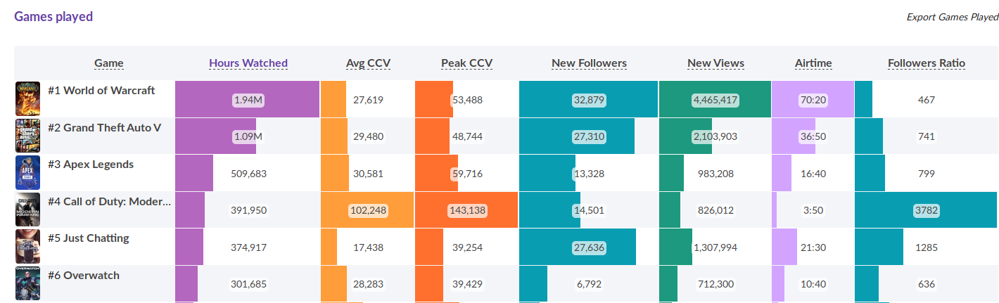

# Data Engineer Strean Hatchet Technical Test 
<br><br>
<br>

&ensp;Hello Stream Hatchet Crew! I hope you like this little notebook I have prepared for you guys! It looks like it's a lot at first glance, but don't worry, most of the space is taken up by images!<br>
&ensp;Also, there are bonus sections that you can skip,if you wish to!
<br>


<br>
<br><br>

****

## 1. You are given the following SQL tables:

<br>

a) streamers: it contains time series data, at a 1-min granularity, of all the channels that broadcast on
Twitch. The columns of the table are:

<br>

 * username: Channel username
 * timestamp: Epoch timestamp, in seconds, corresponding to the moment the data was captured
 * game: Name of the game that the user was playing at that time
 * viewers: Number of concurrent viewers that the user had at that time
 * followers: Number of total followers that the channel had at that time

<br>

b) games_metadata: it contains information of all the games that have ever been broadcasted on Twitch.
The columns of the table are:

<br>

* game: Name of the game
* release_date: Timestamp, in seconds, corresponding to the date when the game was released
* publisher: Publisher of the game
* genre: Genre of the game

<br>


First we need to create our tables.

<br>

```mysql

CREATE TABLE `streamers` (
  `username` varchar(64) NOT NULL,
  `timestamp` datetime NOT NULL,
  `game` varchar(32) NOT NULL,
  `viewers` integer NOT NULL,
  `followers` integer NOT NULL
  
);


CREATE TABLE `games_metadata`(

    `game` varchar(64) NOT NULL,
    `release_date` datetime NOT NULL, 
    `publisher` varchar(64) NOT NULL, 
    `genre` varchar(64) 

);


```


## Write an SQL query to:

<br>

#### 1. Obtain, for each month of 2018, how many streamers broadcasted on Twitch and how many hours of content were broadcasted. The output should contain **month**, **unique_streamers** and **hours_broadcast**.


<br>


```mysql 

SELECT  strftime('%m',`timestamp`) AS months ,COUNT(DISTINCT username)AS `unique_streamers`, COUNT( strftime('%M',`timestamp`))/(60*1.0) as hours_broadcast
FROM streamers where strftime('%Y',`timestamp`) = '2018'
GROUP BY months 

```

<br>

<br>

&ensp;So, first we select the month with the strftime function for the month display (and to later aggregate the data by month), since we only want the months of 2018, we specify the timestamp year for 2018 in the **FROM** statement. <br>
&ensp;We use **COUNT (DISTINCT username)** in order to obtain the total number of different streamers that will be aggregated by the months column we created beforehand.<br>     
&ensp;The data is captured on a per minute basis, duplicated timestamps are valid since you'll most likely have multiple streams at the same time.<br>
&ensp;My approach was to count all rows ( duplicates included, the datetime format doesn't matter since this is a time series with 1 minute granularity), and divide them by 60 to get the number of hours.       


<br>
<br>
<br>


#### 2. Obtain the Top 10 streamers that have percentually gained more followers during January 2019, and that primarily stream FPS games. The output should contain the **username** and **follower_growth**.

<br>


```mysql

SELECT username, ((MAX(followers)*1.0-MIN(followers)*1.0)/MIN(followers)*1.0) AS follower_growth FROM (SELECT username,followers, genre, "timestamp" FROM (SELECT *
FROM streamers AS A INNER JOIN games_metadata AS B ON A.game = B.game) 
WHERE strftime('%Y',"timestamp") = '2019' and strftime('%m',"timestamp") = '01' and genre = 'FPS')   
GROUP BY username
Order by follower_growth DESC
LIMIT 10 


```

The first thing we need to do is a inner join table to dintiguish FPS from non FPS games.<br>

<br>

**SELECT *
FROM streamers AS A INNER JOIN games_metadata AS B ON A.game = B.game)**


<br>

&ensp;Now we do a subquery on the the table we just "created", where we select what we need: **username** to later display and also to group by **followers** to calculate the growth, **genre** to use as a condition for FPS games, **timestamp** to filter only Jan of 2019.


<br>

&ensp;With this "newly created table" ( it's not a table it's only a query, but we can think of it as a table because we are gonna query from a query), and we use:

<br>

**WHERE strftime('%Y',"timestamp") = '2019' and strftime('%m',"timestamp") = '01' and genre = 'FPS')**

<br>

&ensp;To filter Jan 2019 and FPS games 

<br>

**SELECT username, ((MAX(followers)*1.0-MIN(followers)*1.0)/MIN(followers)*1.0) AS follower_growth**

<br>

&ensp;To calculate growth we used the formula above ( multiplication by 1.0 to typecast to decimal) 

<br>


**GROUP BY username Order by follower_growth DESC LIMIT 10**

<br>

&ensp;And of course we need to aggregate and order the data as requested.


<br>
<br>
<br>

#### 3. Obtain the Top 10 publishers that have been watched the most during the first quarter of 2019. The output should contain publisher and hours_watched.

<br>

##### &ensp;Note: Hours watched can be defined as the total amount of hours watched by all the viewers combined. Ie: 10 viewers watching for 2 hours will generate 20 Hours Watched.


<br>
<br>

```mysql

SELECT publisher, (cast(strftime('%m', "timestamp") as integer) + 2) / 3 as quarter, COUNT((strftime('%M',`timestamp`)/(60*1.0)) * viewers) as total_hours_watch
FROM streamers AS A INNER JOIN games_metadata AS B ON A.game = B.game 
WHERE quarter = 1
GROUP BY publisher 
ORDER BY total_hours_watch DESC
LIMIT 10 ;

```

<br>
<br>
<br>
<br>

****

# 2.

<br>


*"Imagine a new streaming platform has recently launched. They provide an API endpoint that allows
third-parties to obtain, at any given time, the list of all the channels broadcasting in the platform, how
many concurrent viewers each channel has, what game is each channel playing, etc.<br>
At Stream Hatchet we want to capture that information and offer it to our clients through our web app,
providing rankings of top-performing streamers and games for each day, week, month, etc. <br>
Explain, in detail, how would you design and implement a system that is able to achieve that. From the
data gathering to serving the information to the web app so that the end user can consume it, detail
how you would implement each step, focusing on scalability and reliability.<br>
Describe what specific technologies, frameworks, and tools you would use and how you would deploy
the system on a cloud-native infrastructure."*

<br>
<br> 

# Implementation 

<br>

<br>

&ensp;Here I'll be using Opennotify's ISS Api, for demonstration purposes:


`


```python
import requests , json 


parameters = {"lat":41.3851, "lon": 2.1734}
response = requests.get("http://api.open-notify.org/iss-pass.json", params=parameters) # When is ISS gonna hoover over Bcn?
# Get the response data as a python object. Verify that it's a dictionary.
data = response.json()
print("Response code: {}\n".format(response.status_code))

print("Content type : {}\n".format(response.headers["content-type"])) # response meta data

print("\n Data type : {}\n".format(type(data))) #data type 

print(data)
```

    Response code: 200
    
    Content type : application/json
    
    
     Data type : <class 'dict'>
    
    {'message': 'success', 'request': {'altitude': 100, 'datetime': 1568650484, 'latitude': 41.3851, 'longitude': 2.1734, 'passes': 5}, 'response': [{'duration': 547, 'risetime': 1568661690}, {'duration': 647, 'risetime': 1568667420}, {'duration': 594, 'risetime': 1568673278}, {'duration': 570, 'risetime': 1568679152}, {'duration': 630, 'risetime': 1568684973}]}


<br><br>
&ensp;So to interact with the API I would use **requests** , **json** python modules. <br><br>
&ensp;Of course this is a simple example, and almost every API is different, so here the most important thing would be to check the **API's Documentaion** and see how to query the **data we want properly**!
&ensp;So, now we have the data but it's in a **JSON format**, and this is no way to present information to the users!
<br><br>&ensp;**To display** the information we gathered from the API I would use **Dash**.
<br>

&ensp;**Dash is a Python framework for building analytical web applications**, and it's built on top of Plotly.js, React and Flask.

<br>

&ensp;You can find some example apps [here](https://dash-gallery.plotly.host/Portal/?search=) and as you can see it's a very flexible and well designed framework! 

<br>

## Deployment 

<br>

&ensp;For deployment I would use [**AWS's Elastic Beanstalk**](https://www.youtube.com/watch?v=SrwxAScdyT0), it's a good and easy choice for app deployment!

<br>

*With Elastic Beanstalk, you can quickly deploy and manage applications in the AWS Cloud without having to learn about the infrastructure that runs those applications. Elastic Beanstalk reduces management complexity without restricting choice or control. You simply upload your application, and **Elastic Beanstalk automatically handles the details of capacity provisioning, load balancing, scaling, and application health monitoring**.*  YOU SHOULD INCLUDE YOUR SOURCE


<br>

&ensp;First we create and activate a virtual enviroment for our dash app


```shell
$ cd ~
$ python3 -m venv .venvs/dash
$ source .venvs/dash/bin/activate

```


<br>
&ensp;We create the two necessary files to get a basic Dash app up and running


```shell

$ touch application.py
$ touch Dockerfile.local


```

&ensp;Then we install our Dash packages and **freeze** <br>


```

pip install dash==0.21.1 
pip install dash-renderer==0.12.1 
pip install dash-html-components==0.10.1
pip install dash-core-components==0.22.1
pip install plotly --upgrade
```


```
pip freeze > requirements.txt
```


&ensp;Then we open the **Dockerfile.local** with an editor and add the following:


```
FROM amazon/aws-eb-python:3.4.2-onbuild-3.5.1

```
<br>
&ensp;This pulls down the AWS beanstalk image preconfigured for python applications.
<br>

&ensp;Then we just **build the docker image and run it** (for testing)!<br>

```
$ docker build -t dash-example
$ docker run -it --rm -p 3000:8080 dash-example

```

&ensp;We navigate to http://localhost:3000/ and we should see our app! 

&ensp;Now we are **ready to start deploying!**


<br>

&ensp;Now you can use the ELastic Beanstalk CLI, or create a zipfile to be uploaded from the portal!<br>

&ensp;Let's go with the **zip file approach**

<br>

```
$ zip dash-example.zip application.py requirements.txt

```


&ensp;Log into AWS console and navigate to Elastic Beanstalk, and click on **Create New Application**

<br><br>

&ensp;Now we are going to create an environment. **An environment in elastic beanstalk is a unique deployment of an application**. You can have as many environments as you like with different configurations. Another nice feature is that you can hot-swap the URLs between environments, this [**allows you to do blue-green deployments**](https://docs.cloudfoundry.org/devguide/deploy-apps/blue-green.html).

<br>

&ensp;Next we click on **Create one now** <br>

&ensp;And next choose **web server enviroment or worker enviroment** <br>

&ensp;Now we arrive at the **Create a new enviroment** screen <br>

&ensp;After we move on to **Base configuration**, where you'll upload the zip file and select 
the **preconfigured python docker image**. <br>

&ensp;Finally click **Create Enviroment** and click on the **URL near the top** and your app should be running from **Elastic Beanstalk**


<br><br>
****
<br><br>
# 3.
<br><br>


<br>

*"A 4-year-old is trying to build a tub for his goldfish out of Lego. Every Lego piece is stuck to the piece to
its left and its right (except for the first and last one). All the pieces have a width of 1 unit.
<br>Write a program, using the programming language of your choice, that given the heights (in units) of the
lego pieces from left to right, outputs the total amount of water held over the pieces that the kid built."*


<br><br>
<br><br>


&ensp;For this question I decided to make a short 5 minute youtube clip, detailing my approach, I hope you enjoy it! 


<br>

<br>


[](https://www.youtube.com/channel/UCW6qBfYgb-w1EiplkuQf9hA?view_as=subscriber)


<br>

# Implementation:

<br>
<br>


```python
def max_min_rl_lr(*args):
    """
    Given a number of values specified by the user
    returns the a list with the biggest elements updated from right to left, 
    and from left to right.
    
    ie - input [3,1,3,4]
    
    outputs : rl = [3,3,3,4]
            : lr = [4,4,4,4]
    
    :param *args: int  
    :return: rl , lr , lists 
     
    """
    rl = list() # list of maximum right to left 
    lr = list() # list of maximum left to right 
    big_rl = None # holder for max value
    big_lr = None # holder for max value
    og =  list(args)
    for w in args: # Loops through the arguments
       
        # condition if holder is 0,(beggning of the loop) appends the first value 
        # or if current element is bigger than holder, holder becomes the new value  
        if big_rl is None or w > big_rl: big_rl = w 
            
        rl.append(big_rl) # appends the 
            
    
    # The same as before but with the input inverted 
    
    for w in list(reversed(args)): # list(reversed(args)) , reverses the order of the list, reading left to right
    
        if big_lr is None or w > big_lr: big_lr = w
            
        lr.append(big_lr)
    
    # We need to revert the list again so it's in the "orignal format"
    
    return rl ,list(reversed(lr)) , og 
    
            
            
    
```


```python
def draw_tank(original):
    """
    Draws the original configuration 
    
    :params original: list 
    
    :returns: void
    
    """
    print("\n Original Configuration is : \n")
    
    
    
    for row in range(max(original), 0, -1): # Loops from max of the list to 0, so to get row 3 , row 2, row 1.
        print(' '.join(['#' if height >= row else ' ' for height in original])) # prints horizontally a symbol if the height (element of list) => row number  
                                                                     # else prints an empty space
    
   

```


```python
def min_of_two_lists(l1,l2):
    """
    Given two lists, iterates through both in paralel and stores the minimum
    into a new list.
    
    :param l1: list
    :param l2: list
    :return: list
      
    """
    # list comprenhension, loops through both lists in paralel with the zip function,
    # and stores the minimum element per iteration     
    
    return [min(j) for j in zip(l1,l2)]


    
    
```


```python
def total_water(original,minimum):
    """
    Calculates the difference the newly created list that holds the minimum of the right to left and left to right peaks list
    with the orignal list of the configuration specified of the user, and calculates the volume of water.
    
    :param original: list
    :param minimum: list
    :return: list
    
    """
    import numpy as np

    
    sub_list =list(np.subtract(minimum,original))
    
    return(np.sum(sub_list),sub_list)

```


```python
rl , lr, og =  max_min_rl_lr(3,1,1,2)

min_two =  min_of_two_lists(rl,lr)

draw_tank(og)


print("\nOriginal configuration: {}".format(og))
print("\n\nRight to left peaks: {}".format(rl))
print("\nLeft to right peaks: {}".format(lr))


print("\n\nMinimum of {} and {} : \n\n {}".format(rl,lr,min_two))

water,dif = total_water(og,min_two)

print("\n\n The total amount of water held by the configuration is : \n \n {}".format(water))


```

    
     Original Configuration is : 
    
    #      
    #     #
    # # # #
    
    Original configuration: [3, 1, 1, 2]
    
    
    Right to left peaks: [3, 3, 3, 3]
    
    Left to right peaks: [3, 2, 2, 2]
    
    
    Minimum of [3, 3, 3, 3] and [3, 2, 2, 2] : 
    
     [3, 2, 2, 2]
    
    
     The total amount of water held by the configuration is : 
     
     2


****

<br>

# 4 

<br>

## A)  Focusing on one or two sections of your choice, explain what insights you can extract from the data that is being represented.  

<br><br>


## **Channel Searcher Section** 

<br><br>


&ensp;I found this section useful for streamers that want to take an analytical approach to analyse their their stream performance and for sponsors who are looking for successful streamers to promote their brand/product! 
<br>

<br>
&ensp;With a simple glance, the user can inspect a couple of important KPI's such as:

<br>

*  Which **game** draws more **viewership**, produces more **followers**, **hours watched**   . 

*  What's the **best combination of games** to be played in a session

*  Which is the **best time to stream** a certain game, or just stream overall

*  The best **stream titles**  

<br>

&ensp;These KPI's can be extracted over different time ranges, so they could evaluated them by day ,week or month. 


<br> 

### Shroud Channel Example

<br>


<br>


&ensp;Here we have a brief statistical summary of the channel performance for the month of July. <br>

<br>

&ensp;Which is of interest for the streamer as well for potential sponsors!

<br> &ensp;Taking a more detailed look :





<br><br>


&ensp;We can see that the most played game during the month of **August** was **World of Warcraft**,  it also has the most followers and new viewers. The least broadcasted game is **Call of Duty**. But, **Call of Duty** had the best **Peaks & AVG CCV's** and also recorded **half the number of new followers**  with only **5%** of broadcasted air time compared to **Wow** .

<br>

&ensp;With this **information** streamers can choose which games to play in order to **prioritize** the **metric** they wish to improve as well as **measure the impact a game has on the audience**. 


<br><br>

## **Rankings Section** 


<br><br>

&ensp;In this section, we can analyse the different KPI's over different platforms ! <br>
<br>
&ensp;We know twitch is the main platform for streaming gaming content, but **sometimes sheer viewership** doesn't tell us the whole story!
<br><br>
&ensp;The other performance metrics, can help users evaluate the platform performance in various different ways. For example, a sponsor might be more interested in **overall platform statistcs**, while a streamer might have more interest in **per channel statistics**.   

<br>
<br>


<br>
<br>

<br><br>

&ensp;A look at the number of unique channels in each platform shows us another perspective:

<br><br>


<br><br>

&ensp;Microsoft's streaming platform Mixer has showed a steady growth, even overthrowing twitch this past month!

<br><br>

&ensp;However I'd like to pose a **question**:
<br>

* **Does more content creators create a more healthy and active platform?**

<br>

&ensp;One could assume that more content creators is always a good thing to have. However we can also pose this **question**:


* **Is this increase of  active content creators benefiting or hurting the content creators, and the platform itself?**

<br>


&ensp;Too many streamers is not such a good thing after all, and it **may** be causing **an AVG CCV per channel of less than 1 viewer**.<br>
<br>
&ensp;Facebook has hands down the best performance, it has a lot less channels than mixer or twitch resulting in a excellent AVG CCV for its streamers !  <br>


<br> 
<br>
&ensp;And when looking at the **popular streaming moments metric, Youtube is on par with Twitch**. 

<br>
 

 
 
<br>
<br>

&ensp;To summarise, **this section offers different perspectives on channels performance**, and lets the users of **Stream Hatchet's Platform** decide which is the platform more suitable for them! 


<br>
<br>


# Games Section - Vanilla Wow Analysis ! ( Bonus ) 

<br>

&ensp;From this section one can derive various insights, mainly the **popularity of a game not only in viewership** but also with the number of **content creators**! I'm gonna analyse the recent resurface of Wow!  

<br> 

&ensp;In 2018, fortnite has dominated the streaming scene! 

<br> 


<br>

&ensp;The sheer magnitude of Avg Channels,and Airtime isn't comparable to any other game! There was so much broadcasted content and creators, that Fortnite was hands down the most popular game **not only in viewership** but also with **content creators**!   


<br>

&ensp;In **2019, fortnite still dominates** the scene,ranking at number one every month! But something **changed** this past month, something that **fans from all over the world have been craving for years and years**! (me included)   


<br>

&ensp;Taking a look at the overall statistics of the month of August: 

<br>


<br>


<br>
<br>

&ensp;Fortnite still dominates, however **Wow that ranked # 13 in July** suddenly **jumped to # 3** !  

<br>


<br>

&ensp;**Aug 19th   to   Aug 25th - Week 34, 2019** Wow was still ranked at **#11**, with a **share of 2.5%**!!

<br>


<br>

**What happened?** 

<br>


&ensp;On **26th of August** the greatly anticipated release of the official **Vanilla Wow Servers** happened! <br>

&ensp;Was this a massive disruption on twitch ? **YES**, take a look at next week's data **26th August to 1st September - Week 35, 2019** !

<br>


<br>

&ensp;Despite Fortnite having a similar amount of broadcast time, and content creators, **WoW dominated the viewership reach**, with a staggering **difference of 36 Million Hours watched** over Fortnite, and reaching a **22.4% share** over the entire platform!  

<br>

&ensp;This past week, recorded over **31 million hours watched** ,take note that in **July fortnite clocked in 88 Million Hours** of content watched! Just these past two weeks **Wow clocked in 83 Million Hours** ! 
&ensp;Probably due to the **hype built over the years** for this release, even I, an Ex-Wow player, have been dreaming of this day for the past 5-6 years! <br>
<br>
&ensp;Vanilla Wow was one of the most important online multiplayer game releases, my theory of this great shift in viewership in the past 2 weeks, is the **nostalgia factor** but is it enough to steal Fortnite's thunder?    

<br> 
<br> 

##  Does this pose a real threat or is it just hype? 

<br> 

<br>

&ensp;One of Wow's biggest problems, is the **dead months** before the release of new content, right now it's hot since it was released two weeks ago, my prediction is that **in time fortnite** will start to **resurface as the biggest player in the streaming scene again**,not only that but **it also appeals to a younger audience of new gamers**, while **Vanilla Wow's main demographic is older**. <br>

&ensp;Only time will tell, but I don't think that **Vanilla Wow** has the power to retain massive viewership for a long period of time! (despite being awesome!)
&ensp;Wow will be divided into 4 stages of release of content, so it'd be safe to predict that during these releases of "new old content", we should see a shift in viewership on twitch!   


<br> 
<br> 


# Bonus of ranking section 

<br>
<br>


<br>
<br>

&ensp;We can see the sheer impact that Twitch has on the streaming scene, as well as its consistent growth over the years.
It's no surprise Twitch dominates the scene, as it started years before its main competitors, building a strong brand over the years.<br><br>

&ensp;This has led to having over **1 million more average concurrent viewers** over its main competitor Youtube, this is an huge difference. We can also note that if we look at Youtube's maximum average concurrent viewers which is approximately **400k** and we double that amount.Then this basically represents the **difference between the maximum avergave CCV's of Youtube and Twitch**. <br> <br>
&ensp;One interesting seasonal pattern found present over the years of Twitch's existence (specially since 2015) seen in **average concurrent viewers** is the **growth** in the **month of January**!This is highly noticeable **in 2018** where it had its **biggest growth ever recorded!**  <br>

<br>

&ensp;My first thought was that in order to maximize their sales, most publishers tend to **publish games during Christmas holidays**.However I didn't find data to support this hypothesis.<br>

<br>

<br>

<br>


<br>
<br>


&ensp;Looking at the performance of the channel ELEAGUE of the month of January 2018, confirms this. 


<br>
<br>

<br>


<br>
<br>

<br> <br> 


&ensp;**My question**: Is ELEAGUES Majors tournament causing a peak CCV in the whole platform, or is this a seasonal holiday pattern? 
<br><br>


<br>

&ensp;The **ELEAGUES CS MAJORS FINALS** took place on Jan 29th, which also corresponds to the highest recorded peak of the month.
<br>
&ensp;Now taking a look at the Peak CCV of the whole platform : 


<br> <br> 

<br>

&ensp;So sponsors and advertisers be aware, since this may not be a seasonal pattern caused by Holidays! 


<br>


****

# b)

<br>
<br>

*"Propose a new section for the BI that offers a different perspective.
   Assume that all the metrics present in the BI (game genres, publishers, channels, tournaments,chat, etc.) are available for all the platforms and date ranges.<br>What new insights could a business extract from this new section?"*


<br><br>


&ensp;A new section that I think would be interesting to integrate right now in the BI with the data available, would be a **viewer dedicated section**. <br>
<br>
&ensp;One of the **main goals of streaming** is delivering content to the maximum amount of viewers possible, maximizing the reach, whether it would be as a **personal brand** (streamers name) or a **sponsor brand**. <br>
**Knowing your audience** looks like an important step in order to maximize your stream and brand value. This section could answer a **series of  questions** like:


<br>
<br>
<br>

* **What's the twitch's viewers sentiment towards a specific brand, stream or game is? This could be based on chat rooms, views, gained views etc** 

<br>

* **How many active users are on the platform at any time?** 

<br>

* **What's the average length of stay of a viewer on twitch of a specific channel or game?**

<br>

* **What's the percentage of total viewers by game genre?**  

<br>

* **What's the busiest time of the day, year, week and month?**  

<br>


* **Top 10 words/expressions used in chatrooms** 

<br>

* **Top 10 languages used by the audience in chat rooms (English, Spanish)** 


<br> <br>


&ensp;This **new section** could include metrics **gender, age, nationality** of viewers, so that streamers and brands can **better target their audience**!


<br><br>


&ensp;The data is already available on the platform,**there seems to be a section for everybody, games, publisher, channels, brands** a section that seems to be missing here is the **audience** section. <br>


****

<br> <br>

## a) Looking at the metrics that are available in the BI, think of a dataset(s) that you would use to apply Machine Learning to extract new information.

<br>

### &ensp;&ensp; Explain what techniques you would use and how the new information would be valuable.<br><br>

<br>


&ensp;There is an intereting opportunity to apply Machine Learning Techniques on the **Rankings Data Set** especially for Twitch. While analyzing Twitch data, I found an interesting **seasonal pattern** for the month of January and we have a rich data set for twitch with 7 years of data with monthly **granularity** for all years, and daily granularity for this year. <br>
&ensp;Here it could be interesting to apply different **Time Series models**, if done correctly we could even be able to **predict platform peaks** for example, which would prove useful for users who want to maximize their viewership reach! <br> <br>

&ensp;Almost all datasets available, have a very strong **Time component**, so in my opinion treating this as a **Multivariate Time Series**  would be a great first approach! Depending on the amount of data points available, I would try to implement an **LSTM Recurrent Neural Network**.   <br>

<br>  

&ensp;Here's a table of some **Time Series Models** :

<br>
<br>


<br>
<br>
<br>
<br>


<br>
<br>
<br>
<br>


&ensp;We could also apply machine learning to predict prize pool's for certain future tournaments, or how many **peak or avg CCV** the tournament will have! <br>

<br>
<br>

<br>
<br>


#  Chat  

<br>
<br>

<br>


 


<br>

&ensp;I assume that the platform already has access to twitch's chat API, so with this dataset we could perform **sentiment** analysis using the **NLTK** library. <br>
<br>
&ensp;**NLP, has seen amazing progress** over these past years!**Implementations of this** are already available on [github](https://github.com/bthomas2622/twitchDisposition).
<br>

&ensp;There are benefits to use NLP beyond **knowing if people like or dislike a certain streamer**, we could also search for messages like *"Fortnite is awesome"* , *"Intel is the best"* to perform **brand sentiment**.

<br>
<br>

*** 

<br>

<br>

#  Conclusion 

<br>

So this concludes my technicalt test, I hope you enjoyed and found it interesting.I may not be an candidate with loads of experience but where I lack skills, I fill it with **dedication and creativity**! 
<br><br>

I hope this technical test shows it, aswell as the **effort and importance** I put into to this, showing how important joining you is to me! <br>

<br>

Best, José!


```python

```
